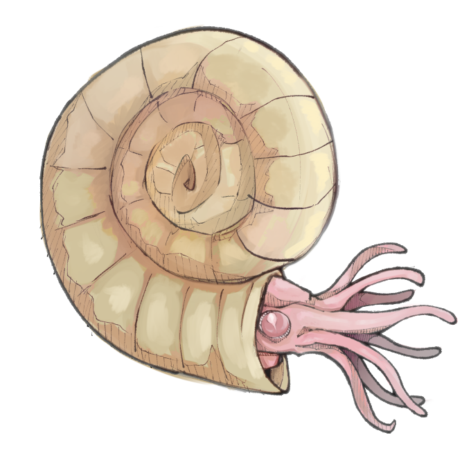
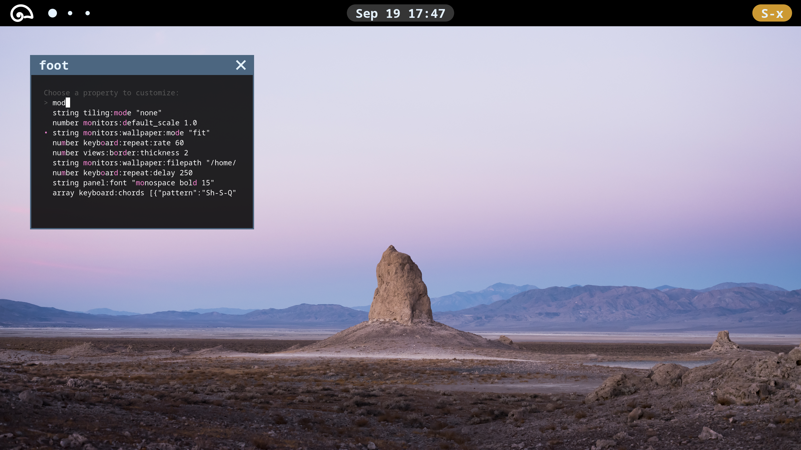

<div align="center">

</div>

# Ptychite
A flexible, approachable, and powerful wayland compositor. This project is still in its early stages; it's not currently usable as a daily driver, but will be soon!

Note: ptychite is now developed on [codeberg](https://codeberg.org/kolunmi/ptychite).



## Project Goals
* performant
* easy to use and configure
* built-in panel, wallpaper, control center, screenshotting-tool, etc
* optional mosaic and traditional window tiling
* optional server-side decorations
* a consistent and comfortable aesthetic design
* basic animations, rounded corners, and blur
* gnome-like workspace management, with the zoom out effect
* Xwayland support
* active application icon support in panel
* NetworkManager and libupower integration in panel
* notifications over dbus
* possibly switch config format from json to yaml

ptychite should have a robust base-level functionality and be completely usable out of the box without the need for external clients.

## Current Dependencies
* [wlroots](https://gitlab.freedesktop.org/wlroots/wlroots)
* wayland-protocols
* wayland-server
* wayland-client
* xkbcommon
* [json-c](https://github.com/json-c/json-c)
* [cairo](https://www.cairographics.org/)
* [pango](https://pango.gnome.org/)
* pangocairo
* [librsvg](https://gitlab.gnome.org/GNOME/librsvg)

## Building
Ensure all dependencies are installed, then run:
```sh
meson setup build/
ninja -C build/
```

## Configuration
ptychite is configured in json; all data you send to and recieve from the compositor will be in this format. Upon startup ptychite looks for the file `~/.config/ptychite/ptychite.json` (see `sample_config.json`). This file will instruct ptychite to build a configuration with the given property nodes. Properties are expressed as paths delimited by `:` characters.

This simple configuration will accept the default values for all properties except `keyboard:repeat:rate`, `keyboard:repeat:delay`, and `keyboard:xkb:options`, for which custom values are provided:
```json
{
	"keyboard":{
		"repeat":{
			"rate":60,
			"delay":250
		},
		"xkb":{
			"options":"ctrl:swapcaps"
		}
	}
}
```

### ptymsg
ptymsg is a client program used to configure and query information from ptychite at runtime. It utilizes the ptychite-message protocol to communicate with the compositor.

#### Setting Properties
The `set` command takes two arguments: a property path and json data.
```sh
ptymsg set monitors:wallpaper:filepath '"background.png"'
```
It also takes an optional flag, `--overwrite`, to overwrite lists instead of appending to them.
```sh
# delete all chords before adding
ptymsg set --overwrite keyboard:chords '[{"pattern":"S-x i","action":["spawn","firefox"]}]'
```
Note that multiple properties can be set at once by passing an incomplete property path.
```sh
ptymsg set tiling '{"mode":"traditional","gaps":20}'
# is equivalent to
ptymsg set tiling:mode '"traditional"' && ptymsg set tiling:gaps 20
```

#### Getting Properties
The `get` command outputs the corresponding json data with a property path. By default, the json is pretty-printed; whitespace will be removed if the `--compact` option is passed.
```sh
ptymsg get --compact panel
```
To output the entire configuration:
```sh
ptymsg get :
```

#### View Data
The `dump-views` command will dump information about the current views on the given output or `all` for every view regardless of output.
```sh
ptymsg dump-views eDP-1
ptymsg dump-views --compact all
```

### ptycfg
ptycfg is a script which allows for interactive, user-friendly customization of properties. Simply run in a terminal:
```sh
ptycfg
```
A list of all properties to filter through will appear. You will be prompted to customize the selection depending on the property in question, after which your input will be converted to json data and sent to ptychite via ptymsg.

#### Runtime Dependencies
* ptymsg
* [jq](https://github.com/jqlang/jq) for processing ptymsg output
* [gum](https://github.com/charmbracelet/gum) for creating the cli
* [zenity](https://gitlab.gnome.org/GNOME/zenity) for the color picker

## Contributing
Thank you for your interest in my project!! If you would like to contribute, please [open a pull request](https://codeberg.org/kolunmi/ptychite/pulls) or [file an issue](https://codeberg.org/kolunmi/ptychite/issues).
